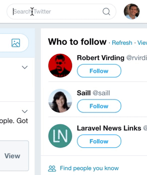
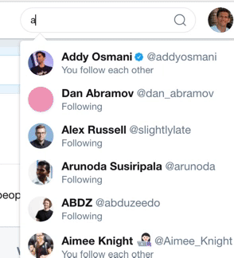

# Trim Twitter Search Results

> Chrome extension that hides the predictive text results in Twitter's search bar.

When performing a search on Twitter, you may have encountered the annoying experience wherein you've typed your query string and are about to click a result, only to be interrupted by Twitter's equivalent of "Did you mean?" >.<

This extension hides the lazy-loaded list of predictive / "helpful" text. You'll never misclick a search result again! :tada:

## Install

Install it from the [Chrome Web Store](https://chrome.google.com/webstore/detail/trim-twitter-search-resul/clkpgpgblnjiddhjfbihcemkaofaibba) or [manually](http://superuser.com/a/247654/6877).

## Screenshots

***Without Extension***

 

***With Extension***

## License

MIT © [Luke Edwards](https://lukeed.com)
